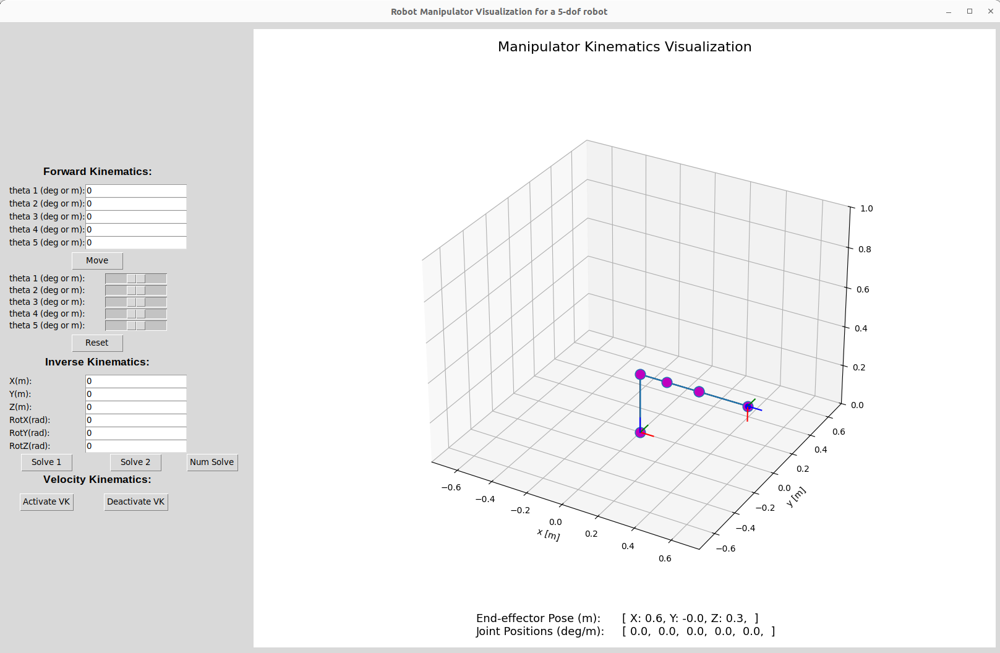
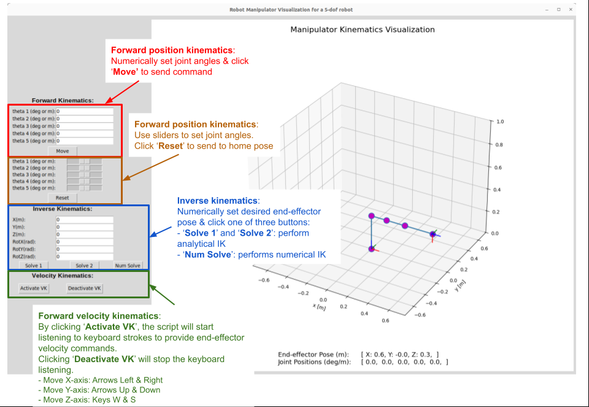

# Analytical Comparison of Trajectory Generation Methods
### Luca Odio, Alexander Qazilbash, Charlie Mawn

## Overview
This repository is intended to generate different trajectories for a robot arm manipulator, and analyze the differences between them. To read a full explaination, download the full techincal report (`Funrobo Final Writeup.pdf`) in the main files of this repo, or use [this link to our google doc](https://docs.google.com/document/d/1NXnxokbGtNPK4Ix7Rf1H444AwomtAVSGzRptKW3EOKU/edit?usp=sharing)

To view a video demo of the project, watch [this video](https://youtu.be/8KKvN-fe4L8), more vide of the project can be found on that youtube channel, and all linked in the writeup

If the repo is already set up on your local machine, below is ways to use the code:

To run the visualizer, and generate a trajectory:

```bash
python3 main_arm.py --robot_type 5-dof     # This is to open the viz tool
# Click reset, upload waypoints, and generate trajectory
```
To Change trajectory generation method, go to `main_arm.py`, then change the `method` attribute to a different trajectory generation method (`"linear", "cubic", "quintic", "septic", "trapezoid", "spline"`) in the `generate_traj_task_space` or `generate_traj_joint_space` method. 

To run a quick analysis on the trajectory generation methods, run the `main_traj.py` file, which is currently configured to analize the computational efficiency of each method

If the local machine is not already set up to run this code, follow the instructions below to guide you for computational setup.


## Viz Tool



#### Step 1: Install Python 3 (if not already installed)
- First, check if you have Python3, to do that, open your terminal and type:
```bash
$ python3 --version     # <--- type this
Python 3.10.12          # <--- you should see something like this
```
- If you don’t have Python installed, follow this [tutorial here](https://realpython.com/installing-python/) to install it.


#### Step 2: Create a virtual environment
- This is technically optional, but I strongly recommend that you create a new python virtual environment for this course.
- Follow this [tutorial here](https://docs.python.org/3/tutorial/venv.html).


#### Step 3: Get this repository from Github
- I recommend you fork this repository to the account of one of your teammates and then you all can clone from the forked version.
- Follow [this tutorial](https://ftc-docs.firstinspires.org/en/latest/programming_resources/tutorial_specific/android_studio/fork_and_clone_github_repository/Fork-and-Clone-From-GitHub.html) to understand how to fork and clone repositories


#### Step 4: Install all required Python packages
```bash
# first: make sure you have activated the virtual environment (if you used one). See step 2 tutorial

# cd to the project folder
$ cd arm-kinematics-module

# install all required packages from requirements.txt
$ pip install -r requirements.txt
```


### How to Run

- If setup worked well, you should be able to run the main script with the command below:
``` bash
$ python main_arm.py 
# this configures the two-DOF arm
```

- There are options to pass command-line arguments to configure the viz tool to other arm configurations, i.e., SCARA and 5-DOF arm

``` bash
$ python main_arm.py -h

usage: main_arm.py [-h] [--robot_type ROBOT_TYPE] 

options:
  -h, --help            show this help message and exit
  --robot_type ROBOT_TYPE
                        insert robot type, e.g., '2-dof', 'scara', '5-dof'
```
- Example, for SCARA robot:
```bash
$ python main_arm.py --robot_type scara
```

### Usage Guide




